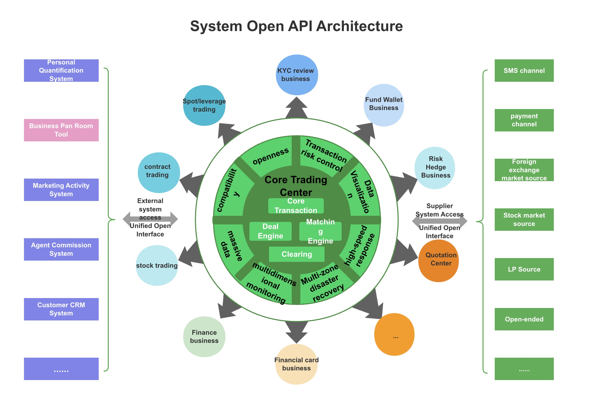

# Overview

## Welcome

Welcome to the ETBmarkets API documentation. We provide complete REST and WebSocket APIs to meet your trading needs. ​

## What is ETBmarkets

It is a white label solution for exchange systems that can quickly build your financial system, foreign exchange trading, stock quotation system, hedging transaction and cryptocurrency quotation system.

Supports multiple trading strategies: contract, spot, risk hedging (single transaction mode) Rich open interfaces, convenient and quick access to mainstream payment systems, and rapid business promotion activities Multi-client support (H5, PC, APP), rich market icons, multiple indicators Powerful backend management supports mainstream white label models and enables the simultaneous development of multiple business models. Flexible parameter configuration capability, various transaction parameter configurations take effect in real time

## Main feature

Full interface coverage: rich open interface capabilities, supporting white label API, client API and external settlement API, etc. Stable data push: Supports real-time subscription and push of white label business data to ensure data accuracy and realize customized services. Real-time transaction data: REST API and WebSocket access ensure low latency and high reliability of transaction data.

## Scenes to be used

Customized client: When you need a white label customized client, you need to refer to this API for client development. External settlement of funds: When the white label has its own wallet account, it can achieve wallet settlement during transactions by accessing this API, without going through a ETBmarkets account. Implement promotion activities: When the white label needs to promote activities, it can access this API to obtain user registration, recharge, and transaction data, and issue bonuses. Personal quantification system: Personal quantification users can apply for apikey through this API and use automated procedures to achieve quantitative transactions. Three-party messaging system: When the white label has its own messaging channel, it can access the white label user’s messages through the open messaging interface and push them to the user terminal through its own channel.\
\

## API Architecture

<figure><figcaption></figcaption></figure>
