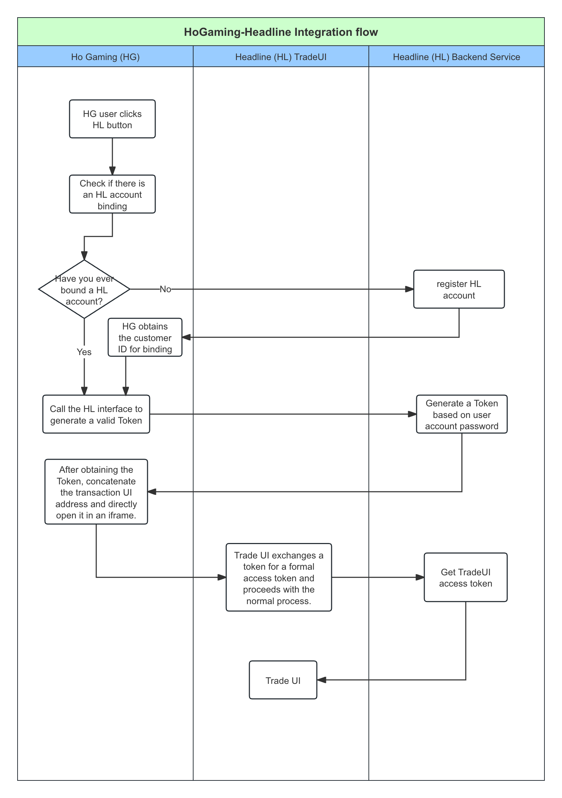

# Process description

## Process Description

1. HG calls the Headline backend API to register and bind users.
2. When an HG user clicks to open Headline, they need to request a one-time token from the Headline API for this specific user. This one-time token can be used to verify the user's identity and authorize their access to the related content on Headline.
3. After obtaining the user's one-time token, HG can use an iframe element to embed the Headline website in its own page. The user’s one-time token is appended to the embedded URL, so that when the user accesses this iframe, the login process will be automated and they do not need to manually enter their username and password.

Interaction flowchart

<figure><figcaption></figcaption></figure>

Detailed interaction diagram：[https://www.processon.com/view/link/662d1a0858531d4d72e2acac](https://www.processon.com/view/link/662d1a0858531d4d72e2acac)


## Register and bind account

When registering users in the HG business system, it is necessary to call the HL trading system interface for user registration and binding.

Use the ManagerApi to create users and bind operations. The interface address is as follows:.

[https://docs.multimarkets.org/manager-api/customer/customer-registration](https://docs.multimarkets.org/manager-api/customer/customer-registration)


Example invocation

Email registration：


```java
OkHttpClient client = new OkHttpClient();

MediaType mediaType = MediaType.parse("application/json");
RequestBody body = RequestBody.create(mediaType, "{\n  \"email\": \"test439@chixi88.com\",\n  \"emailArea\": \"+86\",\n  \"pwd\": \"dc483e80a7a0bd9ef71d8cf973673924\",\n  \"country\": \"CN\",\n  \"customerGroupId\": 1,\n  \"registerSource\": 1,\n  \"tradeTypeCurrencyList\": [\n    {\n      \"allCurrency\": \"USDT\",\n      \"tradeType\": \"1\"\n    }\n  ]\n}");
Request request = new Request.Builder()
  .url("https://pre-api-test.cmfbl.com/openapi-b/customer.admin.WhiteCustomerAdminApiService.addCusAndOpenAccountAndKyc")
  .post(body)
  .addHeader("Content-Type", "application/json")
  .addHeader("Trace", "{{mock_trace}}")
  .addHeader("Token", "{{auto_token}}")
  .addHeader("Version", "0.0.1")
  .addHeader("Companyid", "{{company}}")
  .build();

Response response = client.newCall(request).execute();java
```


Phone registration：


```java
OkHttpClient client = new OkHttpClient();

MediaType mediaType = MediaType.parse("application/json");
RequestBody body = RequestBody.create(mediaType,
"{\"phone\":\"{{mock_phone}}\",\"pwd\":\"dc483e80a7a0bd9ef71d8cf973673924\",\"country\":\"{{national_code}}\",\"registerSource\":1,\"customerGroupId\":1,\"tradeTypeCurrencyList\":[{\"allCurrency\":\"USDT\",\"tradeType\":\"1\"}],\"phoneArea\":\"+86\"}");
Request request = new Request.Builder()
  .url("https://pre-api-test.cmfbl.com/openapi-b/customer.admin.WhiteCustomerAdminApiService.addCusAndOpenAccountAndKyc")
  .post(body)
  .addHeader("Content-Type", "application/json")
  .addHeader("Trace", "{{mock_trace}}")
  .addHeader("Token", "{{auto_token}}")
  .addHeader("Version", "0.0.1")
  .addHeader("Companyid", "{{company}}")
  .build();

Response response = client.newCall(request).execute();
```


Response results：

```json
{
  "msg": "Success",
  "fail": false,
  "trace": "t-h2jv9x-4to64-9mp4wd7-793nv-1661227305",
  "code": "0",
  "data": "86021976",
  "bizCode": "",
  "tm": 236026513,
  "msgParams": null,
  "ok": true
}
```


## Get a one-time token

When opening the Headline trading page in HG, you need to obtain a valid token through the Headline backend interface.

A one-time valid token is requested based on the user customer number and corresponding password that have been bound. The interface address is as follows:

[https://docs.multimarkets.org/client-api/login](https://docs.multimarkets.org/client-api/login)


```java
OkHttpClient client = new OkHttpClient();

MediaType mediaType = MediaType.parse("application/json");
RequestBody body = RequestBody.create(mediaType, 
"{\"type\":2,\"device\":1,\"loginName\":\"13429837442\",\"isThird\":false,\"thirdSource\":\"\",\"bindThirdUserId\":\"\",\"loginPwd\":\"dc483e80a7a0bd9ef71d8cf973673924\"}");
Request request = new Request.Builder()
  .url("https://example.com/login/customer.app.CustomerWebApiService.login")
  .post(body)
  .addHeader("accept", "application/json")
  .addHeader("content-type", "application/json")
  .build();

Response response = client.newCall(request).execute();
```


```json
{
  "msg": "Success",
  "fail": false,
  "trace": "x-31z6g86n-kr01ct-4g1u-ci45-1678377046",
  "code": "0",
  "data": {
    "token": "a541f9d5-2507-42b3-b790-59e1f755c380app",
    "customerNo": "86001175",
    "customerGroupId": 1,
    "thirdUserId": null,
    "googleId": -1,
    "lastName": null,
    "country": "CN",
    "kycStatus": 1,
    "companyKycStatus": 2,
    "assertPassStatus": "2",
    "idCard": null,
    "thirdLoginSource": null,
    "payPassStatus": "2",
    "source": "H5",
    "type": 0,
    "registerSource": 1,
    "loginPassStatus": "2",
    "idCardType": null,
    "loginTime": 1678360534200,
    "associationCompanyId": null,
    "id": 1176,
    "activateStatus": null,
    "email": "22**@qq.com",
    "openAccountType": 0,
    "accountRemark": null,
    "companyType": "real",
    "registerTime": 1648777706117,
    "activateTime": null,
    "kycAuditStatus": 2,
    "optional": 1,
    "isFund": 0,
    "firstName": null,
    "companyId": 360,
    "thirdIntactMsg": null,
    "createTime": 1648777706117,
    "phone": "135******9561",
    "relationCustomerId": 0,
    "accountList": [],
    "name": null,
    "phoneArea": "+86",
    "deposit": 1,
    "rToken": "291e08e4e0af86b3d8af85f2947a02125a1c1746db58b303b06cc1aba389f4cd",
    "thirdServerCode": "",
    "status": 2,
    "withdraw": 1
  },
  "bizCode": "",
  "tm": 82650853,
  "msgParams": null,
  "ok": true
}
```

> :thumbsup:Key note:&#x20;
>
> In the results returned, the Token serves as a single-use token to be used as an opening parameter for the Headline page.


## Open the trading page

Based on a valid token, concatenate the URL address of the iframe in the following format:

[https://www.headline.net/zh-CN/home?tsource=10e87b3b-1278-43f3-a0cb-16cfba88ca4aapp](https://www.headline.net/zh-CN/home?tsource=10e87b3b-1278-43f3-a0cb-16cfba88ca4aapp)

> 📘 Splicing parameter format:
>
> https://www.headline.net/zh-CN/home?tsource=${token}
>
> where token is a valid token parameter.


## Obtain a valid token

> The Headline trading UI needs modification to add the logic for exchanging valid tokens for real access tokens.

The Headline trading UI proactively calls the interface to obtain a real access token based on the tsource parameter in the URL. The interface address is as follows:

[https://multimarkets-c-api-en.apidocumentation.com/reference#tag/customerauth/post/global/thirdExt/randomKey](https://multimarkets-c-api-en.apidocumentation.com/reference#tag/customerauth/post/global/thirdExt/randomKey)


Method of invocation and result:

```java
OkHttpClient client = new OkHttpClient();

Request request = new Request.Builder()
  .url("https://example.com/global/thirdExt/randomKey")
  .post(null)
  .addHeader("accept", "application/json")
  .addHeader("content-type", "application/json")
  .build();

Response response = client.newCall(request).execute();
```

```json
{
  "msg": "Success",
  "fail": false,
  "trace": "x-qfx13-8z5850-mf4l657-gkqbn-1677563999",
  "code": "0",
  "data": "qfx13-8z5850-mf4l657-gkqbn-167756399",
  "bizCode": "",
  "tm": 955,
  "msgParams": null,
  "ok": true
}
```

