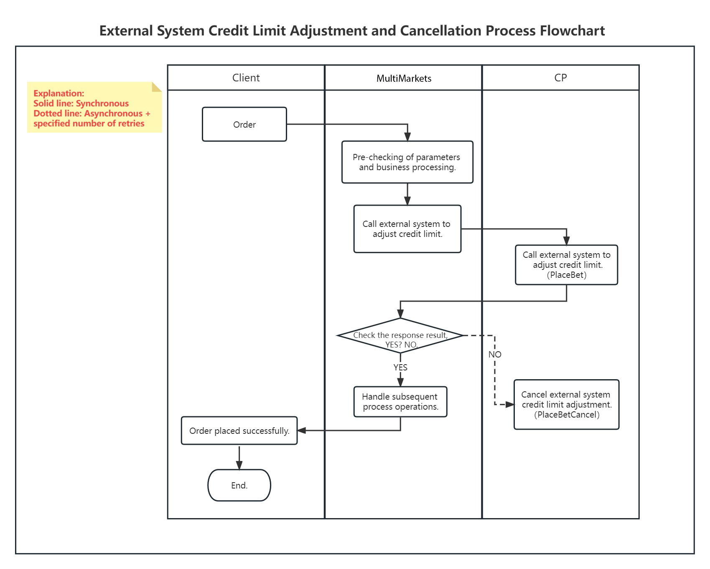

# Overview

Webhook is designed to be clear, concise and easy to integrate. It aims to provide an easy, efficient and secure way for external systems to interact with data without major modifications. It seamlessly connects external systems with the TradeBoss system while ensuring data consistency between them.

Case 1: Users can trade CFD products on the MultiMarkets system and use external system wallets for fund settlement, as shown below:

<figure><figcaption></figcaption></figure>
